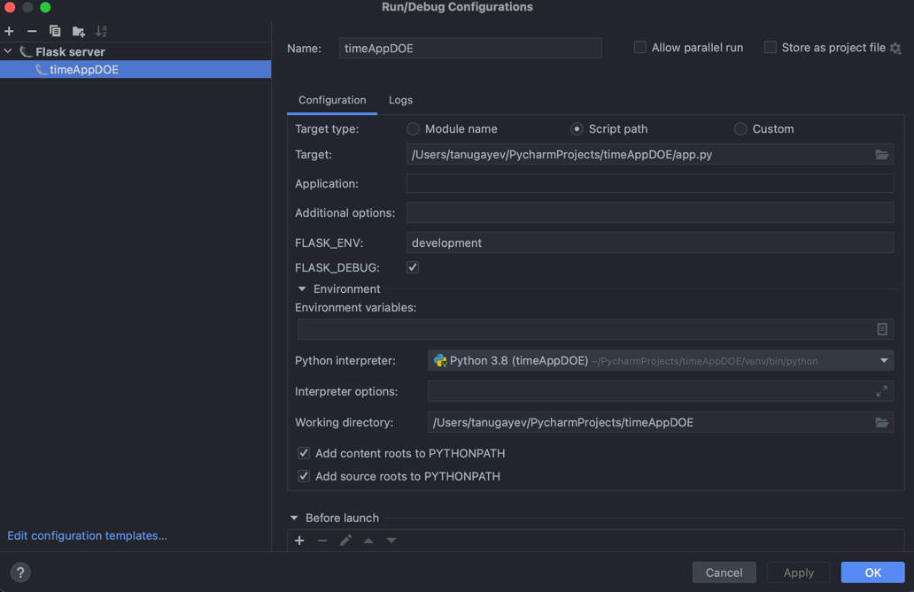

## Best practices applied:

1. Linter (PyLint, goal is to get 10/10), [Markdown linter](https://prettier.io/docs/en/install.html). 
2. Docstrings for modules: 
3. Docstrings for methods: 
4. Templating instead of sending raw html as response like so: 
5. Config for server as a separate file to make it easier to change setup settings later: 
6. Layering/Separation of concerns/Architecture: For this little app I decided to go with a simplified yet structured
   architecture since I might have to scale it later in the course.
7. Environment variables: I use env variables to override some of the settings at the same time not forcing anyone
   that has my repo downloaded to use my settings, they are private and isolated just for
   me: 
8. I set JSON_TO_ASCII to false as it is suggested to do
   to work with cyrillic alphabet, for example: `app.config["JSON_AS_ASCII"] = False`
9. I set up static folder for static pages: `app = Flask(__name__, static_folder='static')`
10. And there is a separate folder for templates as well
11. Virtual Environment not to interfere with my global packages on my OS.
12. Debug mode while developing. Debug mode in Flask watches and restarts server on file changes
    automatically which increases productivity
13. SOLID, DRY, KISS (ideally)
14. Tests

Also, I found
[this](https://auth0.com/blog/best-practices-for-flask-api-development/)
on Flask best practices on the Internet and followed it as well.

In short:

The following tips and practices are the result
of research and more than eight years of experience
building and shipping production-grade APIs with Python:

- Design your API endpoints with proper names and HTTP verbs: `get_home_page()`
- Folder structure (I do not fully agree on this with the author, so I used some design from there and came up with
  the optimal architecture so that the project could scale up and not be too complex)
- Build your documentation from the code
- Testing

## Testing

### Unit tests for this application:

I chose Pytest for testing as it's more popular and easier to use than unittest.

Run 'python3 -m pytest tests/' to start the tests.

- gets current time for Moscow timezone

This test checks that if someone changes the algorithm of obtaining the current time,
the implementation will give the same result as the implementation we have in the first iteration
(e.g. the correct result). It is checking that we obtain the current time for Moscow timezone with en-US with
the locale parameter set to en-US.

- gets correct home route

As we currently have only one route (home, '/'), we have only one test for one endpoint.
This test checks if we successfully retrieved the home page. 

### Best practices applied:

1. Test-driven development (test for Chicago timezone, ru-RU locale)
2. Write Readable, Simple Tests.
3. Write Deterministic Tests.
4. Test One Scenario Per Test.
5. Unit Tests Should Be Automated.
6. Write Isolated Tests.
7. Avoid Test Interdependence.
8. Avoid Active API Calls.
9. Combine Unit and Integration Testing.

sources: https://brightsec.com/blog/unit-testing-best-practices/

## Why Flask?

Based on my research:

- Modularity

Flask is modular (as opposed to Django,
for example, where you get everything out of the box),
so you import only what's needed and what isn't you don't import
This has several benefits like Decoupling, Speed, Scalability.

- Speed & Scalability
  ([source](https://able.bio/hardikshah/6-reasons-why-flask-is-better-framework-for-web-application-development--cd398f73))

It can process a high number of requests as your
business scales up with time. For example, Pinterest
moved from Django to Flask and is processing billions of requests per day.

This is exactly our case as this web application is supposed to be small at
first and then grow as we go towards the end of the course.

- Support for Testing

This course we will write tests, so I have to
make sure this framework facilitates testing,
and it does, so another one for Flask.

- Easy to use & Flexibility

Flask is open to change and has good documentation.

- Community

There's a big community for the framework (50k stars on GitHub)
so most of the questions have already been asked and answered for you
(as opposed to FastAPI, which is relatively new on the arena with its 14k stars
on GitHub)

- Shallow Learning Curve

When web app developers select the framework for their project,
they will think about the learning curve, whether it’s steep or shallow.

It is a natural choice for me as I have no previous experience writing web apps
in Python.

## Flask pros:

[source](https://www.netguru.com/blog/python-flask-versus-fastapi)

1. Scalability
2. Flexibility
3. Simple
4. Many resources (extensions, libs)
5. Documentation
6. Minimalist/Modularity
7. Security (mostly 3rd party extensions)

## Flask cons:

1. Minimalist/Modularity

   As well as a pro it can be a con as it may

2. Lack of support for asynchronicity

   Flask is developed for WSGI services like Gunicorn,
   and so it doesn’t offer native async support.
   This means that long-running queries may actually block the application.
   A REST API built with Flask will be able to handle a smaller number of users.

3. Lack of data validation

   Validation of the data format is absent in Flask,
   which means that developers can pass any type of data,
   including strings or integers.
   This can be compensated using 3rd party libs.

### Conclusion:

From most of the frameworks out there I picked out Flask and FastAPI.
Both Flask and FastAPI can quickly set up web servers.
They require the same amount of effort when it comes to deployment.

Here's a little quote from one of the source web-sites I've come across while
researching this topic:

`If you want to make an app that starts small, but has the potential to grow quickly and in directions you haven’t completely worked out yet, then Flask is an ideal choice. It's simple to use, runs smoothly thanks to just a handful of dependencies, even as you continue to scale.`

Even though, FastAPI is probably faster and uses cutting-edge technology,
it is still not as established as Flask
and has less community support, so I'll go with Flask for this project.

