## Lab 9 - kubernetes

### Python

1. `kubectl apply -f .`

2. `minikube service wtiiim-service`

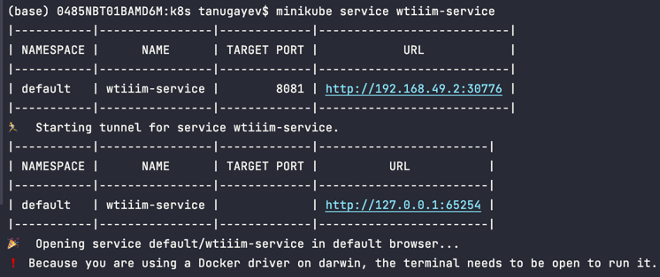

Note that the port in the cli 65254 corresponds to the port in the browser

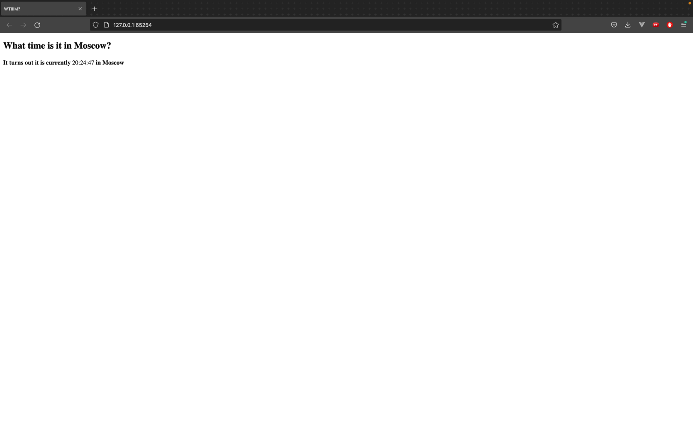

```bash
$ kubectl get pods,svc
NAME                                       READY   STATUS    RESTARTS   AGE
pod/wtiiim-deployment-5ff54dbf96-69vtt     1/1     Running   0          11m
pod/wtiiim-deployment-5ff54dbf96-fxdhg     1/1     Running   0          11m
pod/wtiiim-deployment-5ff54dbf96-wblm5     1/1     Running   0          11m

NAME                       TYPE           CLUSTER-IP      EXTERNAL-IP   PORT(S)          AGE
service/kubernetes         ClusterIP      10.96.0.1       <none>        443/TCP          42m
service/wtiiim-service     LoadBalancer   10.111.28.17    <pending>     8081:30776/TCP   11m
```

```bash
$ minikube service --all
         
|-----------|------------|-------------|--------------|
| NAMESPACE |    NAME    | TARGET PORT |     URL      |
|-----------|------------|-------------|--------------|
| default   | kubernetes |             | No node port |
|-----------|------------|-------------|--------------|
😿  service default/kubernetes has no node port
|-----------|----------------|-------------|---------------------------|
| NAMESPACE |      NAME      | TARGET PORT |            URL            |
|-----------|----------------|-------------|---------------------------|
| default   | wtiiim-service |        8081 | http://192.168.49.2:30776 |
|-----------|----------------|-------------|---------------------------|
🏃  Starting tunnel for service kubernetes.
🏃  Starting tunnel for service wtiiim-service.
|-----------|------------------|-------------|------------------------|
| NAMESPACE |       NAME       | TARGET PORT |          URL           |
|-----------|------------------|-------------|------------------------|
| default   | kubernetes       |             | http://127.0.0.1:49482 |
| default   | wtiiim-service   |             | http://127.0.0.1:49500 |
|-----------|------------------|-------------|------------------------|
🎉  Opening service default/kubernetes in default browser...
🎉  Opening service default/wtiiim-service in default browser...
❗  Because you are using a Docker driver on darwin, the terminal needs to be open to run it.
    
```


### JS

```bash
$ kubectl apply -f .
deployment.apps/wtiiim-deployment unchanged
deployment.apps/wtiiim-js-deployment created
service/wtiiim-service unchanged
service/wtiiim-js-service created
```

```bash 
$ minikube service --all
|-----------|------------|-------------|--------------|
| NAMESPACE |    NAME    | TARGET PORT |     URL      |
|-----------|------------|-------------|--------------|
| default   | kubernetes |             | No node port |
|-----------|------------|-------------|--------------|
😿  service default/kubernetes has no node port
|-----------|-------------------|-------------|---------------------------|
| NAMESPACE |       NAME        | TARGET PORT |            URL            |
|-----------|-------------------|-------------|---------------------------|
| default   | wtiiim-js-service |        8082 | http://192.168.49.2:32062 |
|-----------|-------------------|-------------|---------------------------|
|-----------|----------------|-------------|---------------------------|
| NAMESPACE |      NAME      | TARGET PORT |            URL            |
|-----------|----------------|-------------|---------------------------|
| default   | wtiiim-service |        8081 | http://192.168.49.2:30776 |
|-----------|----------------|-------------|---------------------------|
🏃  Starting tunnel for service kubernetes.
🏃  Starting tunnel for service wtiiim-js-service.
🏃  Starting tunnel for service wtiiim-service.
|-----------|-------------------|-------------|------------------------|
| NAMESPACE |       NAME        | TARGET PORT |          URL           |
|-----------|-------------------|-------------|------------------------|
| default   | kubernetes        |             | http://127.0.0.1:50197 |
| default   | wtiiim-js-service |             | http://127.0.0.1:50215 |
| default   | wtiiim-service    |             | http://127.0.0.1:50221 |
|-----------|-------------------|-------------|------------------------|
🎉  Opening service default/kubernetes in default browser...
🎉  Opening service default/wtiiim-js-service in default browser...
🎉  Opening service default/wtiiim-service in default browser...
❗  Because you are using a Docker driver on darwin, the terminal needs to be open to run it.
```

My JS app running:


My Python app running:
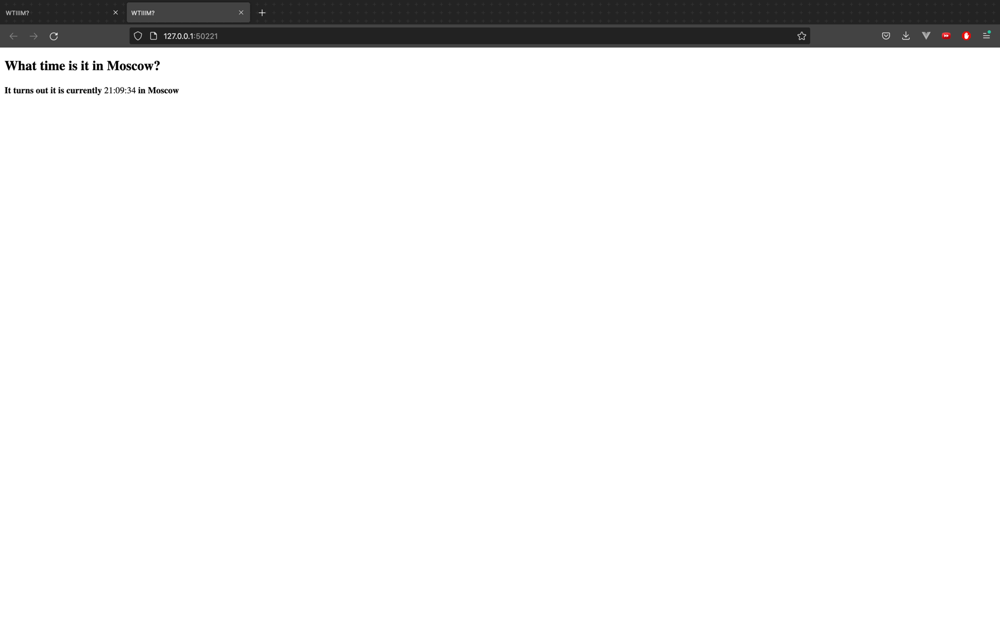

```bash
$ kubectl get pods,svc
NAME                                        READY   STATUS    RESTARTS      AGE
pod/wtiiim-deployment-5ff54dbf96-69vtt      1/1     Running   1 (20m ago)   63m
pod/wtiiim-deployment-5ff54dbf96-fxdhg      1/1     Running   1 (20m ago)   63m
pod/wtiiim-deployment-5ff54dbf96-wblm5      1/1     Running   1 (20m ago)   63m
pod/wtiiim-js-deployment-7445c9868c-6tqqv   1/1     Running   0             19m
pod/wtiiim-js-deployment-7445c9868c-bt6tt   1/1     Running   0             19m
pod/wtiiim-js-deployment-7445c9868c-qtbg2   1/1     Running   0             19m

NAME                        TYPE           CLUSTER-IP      EXTERNAL-IP   PORT(S)          AGE
service/kubernetes          ClusterIP      10.96.0.1       <none>        443/TCP          95m
service/wtiiim-js-service   LoadBalancer   10.109.87.9     <pending>     8082:32062/TCP   19m
service/wtiiim-service      LoadBalancer   10.111.28.17    <pending>     8081:30776/TCP   63m
```

### Research

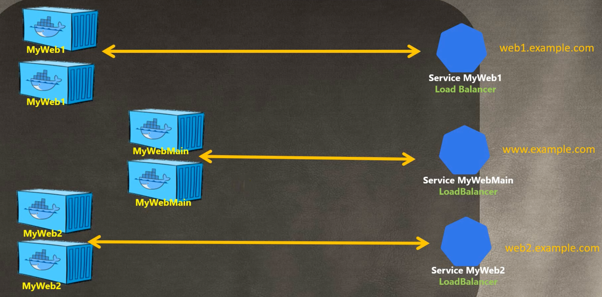
pic from https://www.youtube.com/watch?v=ThP-OEjpDZk

this is without ingress controllers

each load balancer costs you money to maintain

when you have a lot of applications it becomes expensive, so people made Ingress Controllers

#### Ingress

source: https://www.youtube.com/watch?v=80Ew_fsV4rM

Ingress is a Kubernetes component used to abstract out the IP and port of the app
into an actual domain name

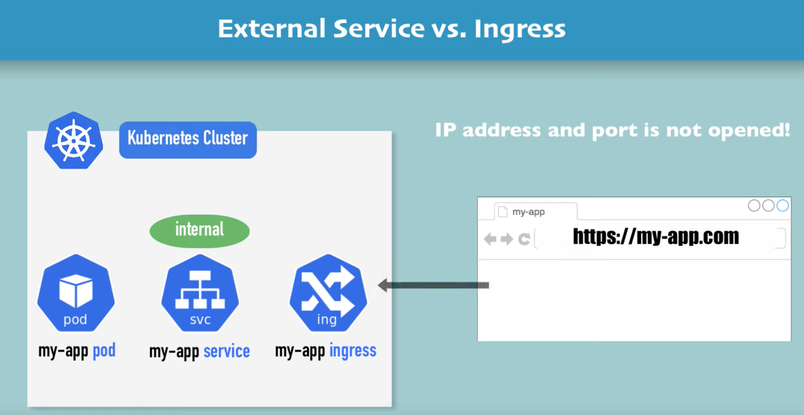

So when a request comes from a browser, it goes it ingress -> internal service -> app pod

without ingress:


with ingress:
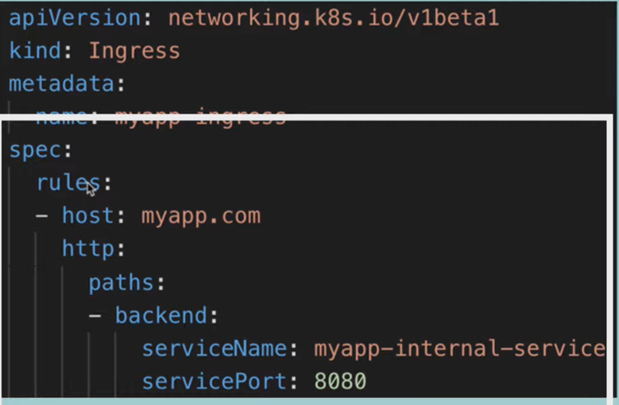

we write routing rules

in this example with ingress, all reqs coming to `myapp.com`
get forwarded to `myapp-internal-service`

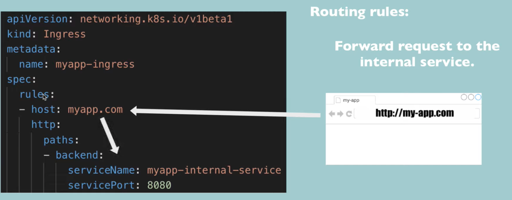

external vs internal services:


#### Ingress controller

with Ingress controller you have intermediate services and ingress controllers that
manage where to route

basically, as i understand, ingress controller has a mapping and it knows where to
map your address that you request with the correct service

it follows the Ingress rules to get to the correct service

for each of our apps we need an ingress rule

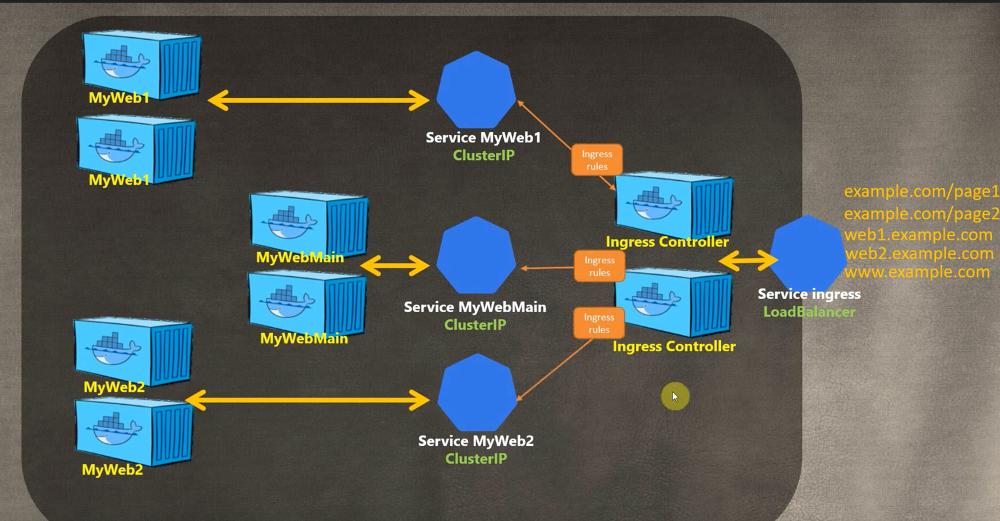

there's different open-source ingress controllers out of the box you can use:


comparison accross ingress controllers:
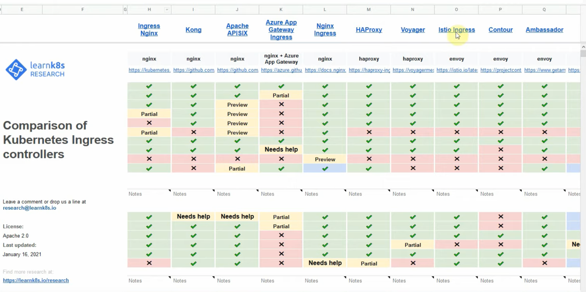

so, basically you just deploy ingress controller apply and write the rules
this is also why we need it

#### StatefulSet

source: https://www.youtube.com/watch?v=pPQKAR1pA9U

stateful app stores data and response depends on state
while stateless app depends on only req payload

stateless apps are deployed using deployment components.
it allows to replicate that app.

stateful apps are deployed using stateful set component.

#### DaemonSet

#### PersistentVolumes

### P. S.

Also here's the result of 3 step in the lab9.md:

```bash
$ minikube service --all
|-----------|------------|-------------|--------------|
| NAMESPACE |    NAME    | TARGET PORT |     URL      |
|-----------|------------|-------------|--------------|
| default   | kubernetes |             | No node port |
|-----------|------------|-------------|--------------|
😿  service default/kubernetes has no node port
|-----------|------|-------------|---------------------------|
| NAMESPACE | NAME | TARGET PORT |            URL            |
|-----------|------|-------------|---------------------------|
| default   | lab9 |        8080 | http://192.168.49.2:31402 |
|-----------|------|-------------|---------------------------|
🏃  Starting tunnel for service kubernetes.
🏃  Starting tunnel for service lab9.
|-----------|-------------------|-------------|------------------------|
| NAMESPACE |       NAME        | TARGET PORT |          URL           |
|-----------|-------------------|-------------|------------------------|
| default   | kubernetes        |             | http://127.0.0.1:50197 |
| default   | lab9              |             | http://127.0.0.1:50203 |
|-----------|-------------------|-------------|------------------------|
🎉  Opening service default/kubernetes in default browser...
🎉  Opening service default/lab9 in default browser...

```

## Lab 10 - Helm

```bash
$ helm install app ./time-app/
NAME: app
LAST DEPLOYED: Mon Nov  7 21:14:12 2022
NAMESPACE: default
STATUS: deployed
REVISION: 1
NOTES:
1. Get the application URL by running these commands:
  export POD_NAME=$(kubectl get pods --namespace default -l "app.kubernetes.io/name=time-app,app.kubernetes.io/instance=app" -o jsonpath="{.items[0].metadata.name}")
  export CONTAINER_PORT=$(kubectl get pod --namespace default $POD_NAME -o jsonpath="{.spec.containers[0].ports[0].containerPort}")
  echo "Visit http://127.0.0.1:8080 to use your application"
  kubectl --namespace default port-forward $POD_NAME 8080:$CONTAINER_PORT
```

```bash
$ minikube dashboard
🤔  Verifying dashboard health ...
🚀  Launching proxy ...
🤔  Verifying proxy health ...
🎉  Opening http://127.0.0.1:62264/api/v1/namespaces/kubernetes-dashboard/services/http:kubernetes-dashboard:/proxy/ in your default browser...
```

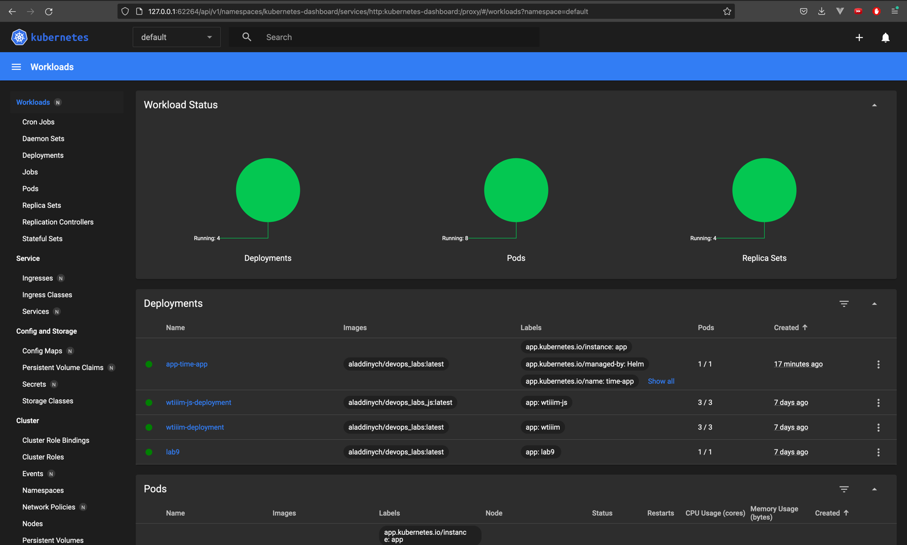

```bash
$ minikube service app-time-app
|-----------|--------------|-------------|--------------|
| NAMESPACE |     NAME     | TARGET PORT |     URL      |
|-----------|--------------|-------------|--------------|
| default   | app-time-app |             | No node port |
|-----------|--------------|-------------|--------------|
😿  service default/app-time-app has no node port
🏃  Starting tunnel for service app-time-app.
|-----------|--------------|-------------|------------------------|
| NAMESPACE |     NAME     | TARGET PORT |          URL           |
|-----------|--------------|-------------|------------------------|
| default   | app-time-app |             | http://127.0.0.1:62550 |
|-----------|--------------|-------------|------------------------|
🎉  Opening service default/app-time-app in default browser...
❗  Because you are using a Docker driver on darwin, the terminal needs to be open to run it.
```

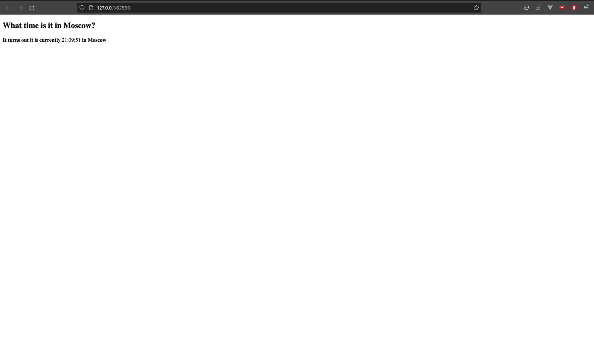


```bash
$ kubectl get pods,svc
NAME                                        READY   STATUS    RESTARTS      AGE
pod/app-time-app-6646b5cd9d-t9qs8           1/1     Running   0             27m
pod/lab9-988c5968b-gljw9                    1/1     Running   5 (32m ago)   7d1h
pod/wtiiim-deployment-5ff54dbf96-69vtt      1/1     Running   5 (32m ago)   7d1h
pod/wtiiim-deployment-5ff54dbf96-fxdhg      1/1     Running   5 (33m ago)   7d1h
pod/wtiiim-deployment-5ff54dbf96-wblm5      1/1     Running   5 (32m ago)   7d1h
pod/wtiiim-js-deployment-7445c9868c-6tqqv   1/1     Running   4 (32m ago)   7d
pod/wtiiim-js-deployment-7445c9868c-bt6tt   1/1     Running   4 (32m ago)   7d
pod/wtiiim-js-deployment-7445c9868c-qtbg2   1/1     Running   4 (33m ago)   7d

NAME                        TYPE           CLUSTER-IP      EXTERNAL-IP   PORT(S)          AGE
service/app-time-app        ClusterIP      10.102.73.31    <none>        80/TCP           27m
service/kubernetes          ClusterIP      10.96.0.1       <none>        443/TCP          7d1h
service/lab9                LoadBalancer   10.105.5.70     <pending>     8080:31402/TCP   7d1h
service/time-app-service    LoadBalancer   10.105.81.138   <pending>     8081:31834/TCP   7d1h
service/wtiiim-js-service   LoadBalancer   10.109.87.9     <pending>     8082:32062/TCP   7d
service/wtiiim-service      LoadBalancer   10.111.28.17    <pending>     8081:30776/TCP   7d1h
```

```bash
$ helm list
NAME    NAMESPACE       REVISION        UPDATED                                 STATUS          CHART           APP VERSION
app     default         1               2022-11-07 21:14:12.506371 +0300 MSK    deployed        time-app-0.1.0  1.16.0   
```

```bash
$ kubectl get services
NAME                TYPE           CLUSTER-IP      EXTERNAL-IP   PORT(S)          AGE
app-time-app        ClusterIP      10.102.73.31    <none>        80/TCP           39m
kubernetes          ClusterIP      10.96.0.1       <none>        443/TCP          7d2h
lab9                LoadBalancer   10.105.5.70     <pending>     8080:31402/TCP   7d1h
time-app-service    LoadBalancer   10.105.81.138   <pending>     8081:31834/TCP   7d1h
wtiiim-js-service   LoadBalancer   10.109.87.9     <pending>     8082:32062/TCP   7d
wtiiim-service      LoadBalancer   10.111.28.17    <pending>     8081:30776/TCP   7d1h
```

### Research

Helm charts allows for a more scalable deployment on kubernetes.

Without charts every time you add a new app you will also need to write
all the .yaml files from scratch (There's also other files that introduce additional
complexity).

And what if these files don't change much from app to app and only small
parts of the configs actually vary. Then you're in for a lot of unnecessary work.


To not do that and to comply with the DRY principle, charts are used.
It uses templating and `values.yaml` to describe the values for the vars in the templates
It basically looks like this:

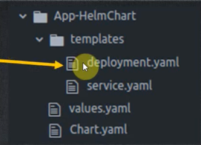

In `values.yaml` you define your values for the variable parts of the configs
and in `chart.yaml` you describe the chart configuration
(version, app version, title, etc.)

Usage:


#### Library Charts

source 1: https://www.youtube.com/watch?v=BIyZna1lotc

source 2: https://helm.sh/docs/topics/library_charts/

Library charts are, i believe, reusable helm charts. So, you write your helm chart
and then want to use it somewhere else, reuse.

You can reuse a helm library chart across multiple apps.

You don't have to recreate deployment and service configs, templates for each app, 
just define it once and reuse across all the apps.

#### Umbrella charts

source: https://itnext.io/helm-3-umbrella-charts-standalone-chart-image-tags-an-alternative-approach-78a218d74e2d

It abstracts out a collection of kubernetes components into another helm chart that
is one abstract layer up. So it's multiple charts in one.

provides Separation of Concerns and Abstraction

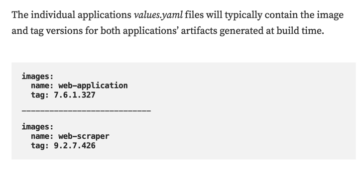


it's not applicable everywhere sometimes you need to update directly each chart.

but if you do use umbrella charts it unifies the process of deployment: versioning,
release of individual charts is minimal.